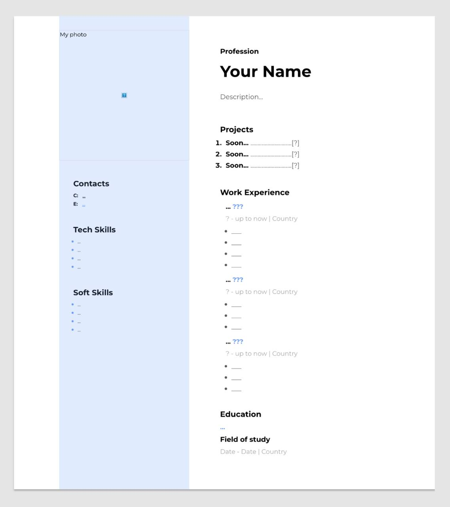

# 💼 Portfolio Website

---

## 📌 Description
This project is a portfolio website template created as part of my web development practice.  
It demonstrates a clean layout and basic structure for presenting personal projects and skills.

---

## 🚀 Features
- Clean and structured layout
- Semantic HTML structure
- Basic styling with CSS
- Sections for projects, skills, and contact

---

## 🛠️ Technologies
- HTML
- CSS

---

## 📁 Project Structure
- index.html – main page
- /css – stylesheets
- /images – screenshots

---

## ▶️ How to run
1. Download or clone the repository
2. Open `index.html` in your browser

---

## 📷 Preview

---

## 🔗 Live Demo
[View Portfolio Website](https://anfoureight.github.io/portfolio-website/)

---

## 👨‍💻 Role
Frontend Developer (Personal Project)

---

## 🎯 Purpose
Practice project focused on building a structured portfolio layout using HTML and CSS.

---

## 🚧 Future Improvements
- Add responsive design
- Improve styling
- Add interactivity with JavaScript

---

## 📚 What I learned
- Structuring a website
- Basics of responsive design concepts
- Working with HTML/CSS together
